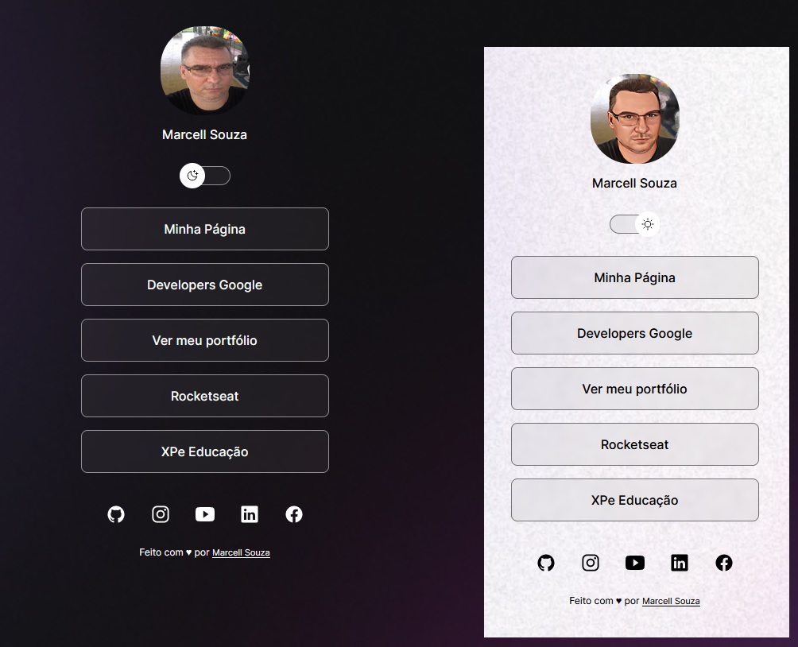

<h1 align="center"> Portfolio </h1>

Programa exclusivo e gratuito, promovido pela Rocketseat para ensino de tecnologias WEB.  
<a href="https://souzamarcell.github.io/Portfolio">Execute esse projeto, para ver como ficou.</a>

  <a href="#-tecnologias">Tecnologias</a>&nbsp;&nbsp;&nbsp;|&nbsp;&nbsp;&nbsp;
  <a href="#-projeto">Projeto</a>&nbsp;&nbsp;&nbsp;|&nbsp;&nbsp;&nbsp;
  <a href="#-Funcionalidades">Funcionalidades</a>&nbsp;&nbsp;&nbsp;|&nbsp;&nbsp;&nbsp;
    <a href="#-Contato">Contato</a>&nbsp;&nbsp;&nbsp;|&nbsp;&nbsp;&nbsp;
  <a href="#memo-licença">Licença</a>

  

 

  

## 🚀 Tecnologias

- HTML
- CSS
- Javascript

## 💻 Projeto

Portfolio é um agregador de links para usar como cartão de visitas online.

## Funcionalidades

- Portfolio de usuários

## Deploy

  https://souzamarcell.github.io/Portfolio/

## Contato 
 
 

## :memo: Licença

Esse projeto está sob a licença MIT.

---

Feito com ♥ by Marcell Souza :wave: [Meu link de Developers Google!](https://developers.google.com/profile/u/marcellsouza)
